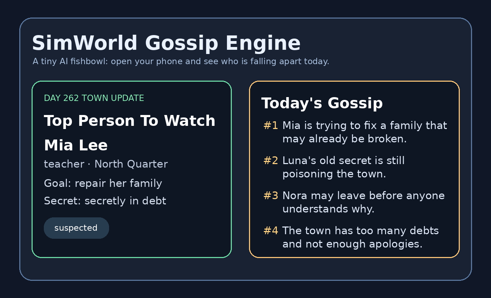

# SimWorld Gossip Engine

> A tiny AI fishbowl: open your phone and see who is falling apart today.

SimWorld Gossip Engine is a lightweight local town simulation where 100 virtual residents live day by day, form relationships, hide secrets, trigger drama, suffer health crises, attempt to leave town, and generate daily gossip reports.

It is **not** a serious social simulation and not a pure AI novel generator. It is a local-first storytelling toy: rules simulate life, memory preserves consequences, and optional local AI turns signals into language.



## Why this exists

Most AI writing starts with a prompt.

This starts with a town.

Instead of asking an LLM to invent a story from nothing, SimWorld runs a small structured world first. Residents accumulate stress, secrets, goals, memories, relationship tension, and consequences. The gossip layer then surfaces who is becoming interesting.

The fun is not controlling the town.

The fun is checking the daily dashboard and discovering who has ruined their life today.

## Features

- 100 simulated residents
- Goals, secrets, stress, health, happiness, wealth, energy
- Dynamic relationships: trust, attraction, jealousy, dependency, resentment
- Long-term memory summaries
- Story score ranking
- Daily simulation loop
- Mobile-friendly web UI
- Daily gossip dashboard: `/gossip`
- Share card page: `/share`
- Secret radar: `hidden → suspected → revealed`
- Health crisis events
- Runaway signals
- Public argument events
- Serial story export
- Optional local AI writing via Ollama

## Demo concept

A typical generated gossip day might look like this:

```text
Top Gossip
#1 Mia Lee is still trying to repair her family while hiding debt.
#2 Luna Zhang's old secret is no longer fully hidden.
#3 Nora Zhang may be preparing to leave town.
#4 Lucas Wilson has a suspiciously emotional secret.
#5 The town trust index is collapsing again.
```

This is the core loop:

```text
simulate town → score drama → generate gossip → read on phone → repeat
```

## Quick Start on Windows

Install dependencies:

```bat
install_windows.bat
```

Run without AI:

```bat
run_windows.bat
```

Then open:

```text
http://127.0.0.1:8000
```

On your phone, connect to the same Wi-Fi and open:

```text
http://YOUR_PC_IP:8000/gossip
```

## Optional Ollama

Install Ollama and pull a small model:

```bat
ollama run qwen2.5:3b
```

Then start the app with:

```bat
run_with_ai_ollama.bat
```

The simulation works without Ollama. Ollama only improves the writing layer.

## Main Pages

| Page | Purpose |
|---|---|
| `/` | Simulation dashboard |
| `/people` | Resident list |
| `/storylines` | Protagonist candidates |
| `/gossip` | Daily gossip dashboard |
| `/share` | Shareable town update card |
| `/today` | Daily story page |
| `/serial` | Serial story archive |
| `/writer` | Dialogue and monologue material |
| `/director` | Narrative diagnosis |

## How it works

This is not 100 independent LLM agents thinking in real time.

It is a lightweight layered system:

```text
structured resident data
        ↓
rule-based simulation
        ↓
relationships + memories + events
        ↓
story/gossip scoring
        ↓
optional local AI writing
        ↓
mobile gossip dashboard
```

That makes it small enough to run on a normal mini PC.

## Project Structure

```text
simworld-gossip-engine/
├── app.py
├── sim_engine.py
├── db.py
├── llm.py
├── templates/
├── static/
├── docs/
├── install_windows.bat
├── run_windows.bat
├── run_with_ai_ollama.bat
├── requirements.txt
├── README.md
├── LICENSE
└── .gitignore
```

## Design Philosophy

SimWorld is closer to a tiny narrative fishbowl than a productivity tool.

It is designed to answer questions like:

- Who is under the most pressure today?
- Whose secret is about to be revealed?
- Who is trying to leave town?
- Which relationship is about to explode?
- Which background character suddenly became the protagonist?

## Roadmap

- [ ] Better continuity between gossip days
- [ ] Named main-character lock mode
- [ ] Export share card as image
- [ ] Better mobile screenshots
- [ ] GitHub Pages landing page
- [ ] Configurable town size
- [ ] More event packs: romance, workplace, school, family, debt, betrayal

## License

MIT
