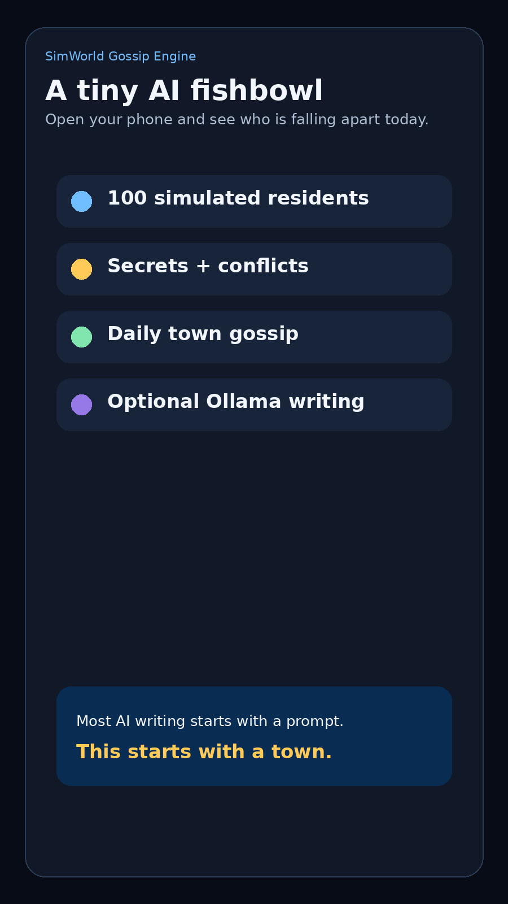

# SimWorld Gossip Engine

> A tiny AI fishbowl: open your phone and see who is falling apart today.


SimWorld Gossip Engine is a lightweight local town simulation where 100 virtual residents live, form relationships, hide secrets, trigger drama, and generate daily gossip reports.

Most AI writing starts with a prompt.

This starts with a town.

The system does **not** run 100 large language model agents in real time. Instead, it uses structured resident data, rule-based simulation, long-term memory, relationship dynamics, and optional local AI writing through Ollama.

The result is a strange little AI fishbowl: a simulated town that slowly produces secrets, conflicts, health crises, runaway attempts, public arguments, and daily gossip.

## Demo



## What It Does

SimWorld creates a small fictional town with residents who have:

- names, ages, jobs, and homes
- goals and hidden secrets
- health, happiness, stress, wealth, and energy
- relationships with trust, resentment, attraction, dependency, and jealousy
- long-term memories
- story scores that determine who is becoming narratively important

Each simulated day, the town advances.

People get tired. Relationships change. Secrets move from `hidden` to `suspected` to `revealed`. Some residents try to leave town. Some fall into crisis. Some become unexpectedly central to the story.

Then the system turns those signals into readable town gossip.

## Core Idea

This project is not trying to simulate human society perfectly.

It is designed to answer a much less serious question:

> What if you could check a local AI town every day and see who is emotionally collapsing?

The simulation layer creates structure.

The memory layer creates consequence.

The gossip layer makes it fun.

Optional local AI makes it more readable.

## Features

- 100 simulated residents
- Daily world advancement
- Mobile-friendly local web interface
- Character ranking and story score system
- Daily gossip dashboard
- Secret radar: `hidden → suspected → revealed`
- Health crisis events
- Runaway signals
- Public conflict events
- Relationship tension tracking
- Serial story generation
- Share card page for screenshots
- Optional Ollama integration
- Runs locally on a normal Windows machine

## Pages

After starting the app, open:

```txt
http://127.0.0.1:8000
```

Main pages:

```txt
/          Home dashboard
/residents Residents
/today     Daily story
/serial    Serial archive
/story     Story candidates
/director  Director view
/writer    Writing material
/gossip    Gossip dashboard
/share     Share card
```

On your phone, use your computer’s local IP address, for example:

```txt
http://192.168.1.23:8000/gossip
```

Your phone and computer must be on the same Wi-Fi network.

## Quick Start

### 1. Clone the repo

```bash
git clone https://github.com/wtbrissy/simworld-gossip-engine.git
cd simworld-gossip-engine
```

### 2. Install dependencies

On Windows, you can run:

```bat
install_windows.bat
```

Or manually:

```bash
pip install -r requirements.txt
```

### 3. Start the local web app

```bat
run_windows.bat
```

Then open:

```txt
http://127.0.0.1:8000
```

## Optional: Use Ollama

The app works without Ollama.

Without Ollama, the simulation still runs and generates rule-based gossip. With Ollama, the daily stories, dialogue, and inner monologues become more natural.

Install Ollama, then pull a small local model:

```bash
ollama pull qwen2.5:3b
```

Then run:

```bat
run_with_ai_ollama.bat
```

Recommended models for a normal mini PC:

```txt
qwen2.5:3b
llama3.2:3b
```

A 7B model may work, but will be slower on machines with limited RAM.

## How It Works

SimWorld is built as a hybrid system:

```txt
Structured residents
        ↓
Rule-based daily simulation
        ↓
Relationship and memory updates
        ↓
Story score ranking
        ↓
Gossip and event generation
        ↓
Optional local AI rewriting
```

The AI does not invent everything from nothing.

It writes from a world that has already moved.

## Why Not 100 AI Agents?

Running 100 full LLM agents in real time is expensive, slow, and unnecessary for this kind of project.

SimWorld uses a lighter approach:

- rules simulate everyday life
- structured data tracks consequences
- memory creates continuity
- story scoring identifies interesting residents
- local AI improves the writing layer

This makes the project small enough to run locally while still producing emergent drama.

## Example Gossip

```txt
Today’s Town Gossip

#1 Mia Lee is under pressure
Her health is collapsing, her family repair goal is active, and her secret debt is now suspected.

#2 Luna Zhang still has unfinished business
Her old secret remains unresolved, but her long-term memory score keeps rising.

#3 Nora Zhang may be preparing to leave
Her runaway signal is increasing, but her debt is keeping her tied to town.

#4 A public argument damaged trust
Two residents argued in public after resentment passed the conflict threshold.

#5 The town is not okay
Multiple residents are showing high stress, low health, and unstable relationships.
```

## Project Philosophy

This is not an AI novel generator.

It is closer to a narrative terrarium.

You do not directly write the plot. You let a town accumulate pressure, memory, secrets, and consequences. Then you watch the story surface.

Or, more simply:

> A tiny AI fishbowl where simulated people slowly ruin their lives.

## Tech Stack

- Python
- FastAPI
- SQLite
- Jinja2
- HTML/CSS
- Optional Ollama local model integration

## Roadmap

Possible future upgrades:

- better secret reveal logic
- stronger continuity between daily chapters
- character relationship graph
- shareable image cards
- configurable town size
- seeded demo towns
- Docker support
- richer event types
- recurring weekly town summaries
- export to Markdown / JSON
- better GitHub demo screenshots

## Disclaimer

This is an experimental side project.

It is not a scientific social simulation, not a psychological model, and not a serious agent benchmark.

It is a local simulation toy for emergent storytelling, town drama, and AI-assisted gossip generation.

## License

MIT License.
